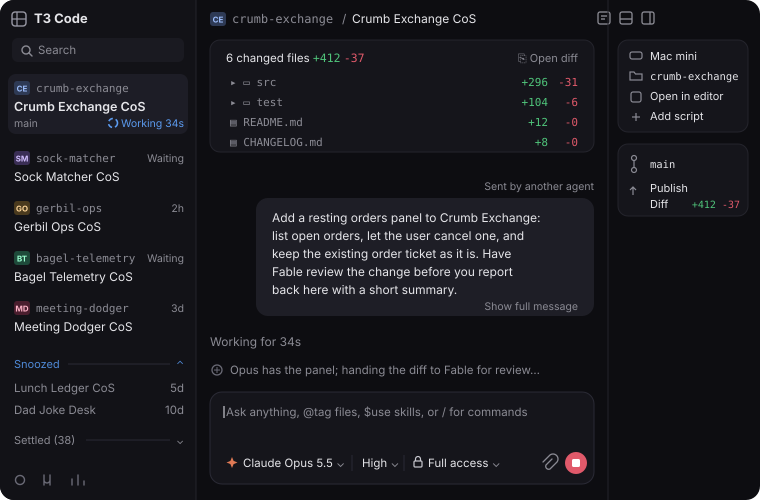
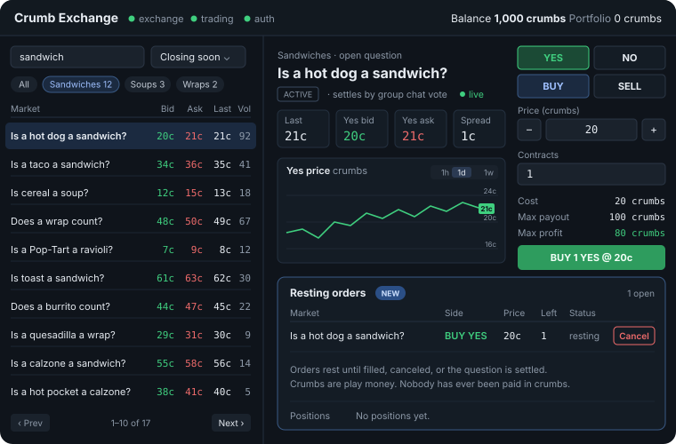

# t3-fleet-gateway

[](https://github.com/boundsj/t3-fleet-gateway/actions/workflows/check.yml)

Let long-running AI agents in the cloud hand coding work to the [T3 Code](https://github.com/pingdotgg/t3code) servers on your own machines, and follow that work to completion.



The agent says *what* to do in *which project*. The gateway decides *where* and *how*: which machine, which T3 project, a fresh git worktree per job, the T3 thread, and watching it. You never have to pick worktrees or threads, or keep checking threads by hand. Every job is an ordinary T3 thread you can open, read and interrupt.

The first supported agent is Grok Bot; any MCP client with OAuth support should work.

## Try it

Setup is two prompts. Agents like Grok Bot run in the cloud, so the gateway needs a public HTTPS URL; it listens only on loopback, so you expose it with a tunnel you run (Tailscale Funnel, Cloudflare Tunnel, ngrok, …).

Give this to a coding agent on the always-on machine that runs T3 Code:

```text
Set up https://github.com/boundsj/t3-fleet-gateway on this machine by
following its README. Enroll this machine's T3 Code server as a host
and add these projects: <your projects>. Run the gateway as a service
and expose it over HTTPS with <your tunnel>. Make sure `doctor` passes.
Then give me the public /mcp URL. When I connect each Grok bot, mint
a one-time approval code for it.
```

Then make one Grok bot per project and give each one this:

```text
Connect to my T3 fleet gateway at https://<your public URL>/mcp.
You own the <project> project. Set up a 15-minute routine that checks
only <project>'s jobs, keeps your place in the feed between checks,
and stays quiet unless a job needs an answer, is ready for review,
or failed.
```

Each bot opens the gateway's approval page. Ask the agent from the first step for a code (`pair`; codes expire after 15 minutes by default) and choose **Operate**. Stagger the routines a few minutes apart so they don't all check at once.

The manual steps behind the first prompt are in [Setup](#setup) below.

## How it works

```
Agent (Grok Bot, any MCP client)
   │  HTTPS through your tunnel, OAuth 2.1 (tokens issued by this gateway)
   ▼
t3-fleet-gateway  ── SQLite (clients, tokens, host credentials, jobs)
   │  MCP client per host, bearer credential issued by that host's T3
   ▼
T3 Code server(s)  ──► one T3 thread per job, in a fresh worktree on its own branch
```

- One process on an always-on machine, listening on loopback; your tunnel is the only way in.
- The gateway is an MCP server to agents and an MCP client to each T3 server. Instead of T3's raw tools, agents get a small job-level contract: `fleet_status` (hosts and projects), `work_start`, `work_continue`, `work_respond`, `work_cancel`, `work_status`, `work_messages` (a job's replies in full), `work_list` and `work_feed` (what changed since the agent's last check, from a cursor it keeps).
- Agents sign in through the gateway's own OAuth 2.1 server: on first connect an agent opens an approval page, and you type a one-time code minted on the gateway machine and choose **Read** (follow work) or **Operate** (start and steer work).
- The gateway holds its own credential for each T3 server and renews it before it expires (T3 credentials last 30 days). Agent tokens never reach T3, and T3 credentials never leave the gateway.

## One project, one bot: standing jobs

By default each piece of work is a new T3 thread. If you run a long-lived thread that coordinates a project (a "chief of staff" that plans, delegates to child threads of its own and reports back), let the agent talk to that thread instead:

```sh
node bin/t3-fleet-gateway.js jobs adopt pilot <thread id> --title "Chief of Staff"
```

The gateway checks that the thread belongs to project `pilot` and records it as a **standing job**. The agent sees it with `standing: true` in `work_list`, `work_feed` and `work_status` (and in `fleet_status` under its project), sends it instructions with `work_continue`, and follows its turns with `work_feed`, `work_status` and `work_messages`, just as for jobs it started. A standing job takes no concurrency slot, `work_cancel` only interrupts its current turn (it stays open), and the agent can never close it. `jobs release <job id>` stops the gateway from following it without touching the thread. Set `"allowWorkStart": false` on the project to make the coordinator the only way in: `work_start` there then fails with `start_disabled`, naming the standing job to use instead.

For example, asking the bot for a project (here a fictional toy app) for a new feature:


*In Grok Bot: the request, then the summary the bot relays when the coordinator is done.*



*The same request arriving in the project's coordinator thread in T3 Code, sent by the gateway.*



*The result: the app with its new resting orders panel.*

**How a coordinator looks to the agent.** When a T3 coordinator delegates, its own turn ends while the child thread works, and T3 starts its next turn by itself when the child is done. So the agent sees the standing job go `idle` (with `waitingOnDelegatedWork: true` and the delegated task titles while T3 shows that work running), then `running` and `idle` again with no action of its own; `work_feed` reports those turns (`turn_started`, `turn_finished`). The tool descriptions tell the agent to read the coordinator's reply and, while it waits on delegated work, to wait for its next turn rather than send new instructions (which would start a competing turn). Replies are always the coordinator's own messages, never a child's summary. Details: [docs/operations.md](docs/operations.md#standing-jobs) and [docs/configuration.md](docs/configuration.md#projects-with-a-coordinator).

## Setup

Requirements: Node.js 24 or newer (the latest Node 24 or 26 release is recommended), a T3 Code server, and the `t3` CLI on the machine that can mint pairing codes for it.

```sh
git clone https://github.com/boundsj/t3-fleet-gateway.git
cd t3-fleet-gateway
npm ci --omit=dev

mkdir -p ~/.config/t3-fleet-gateway
cp config.example.json ~/.config/t3-fleet-gateway/config.json
# Edit publicUrl, hosts and projects. See docs/configuration.md.

node bin/t3-fleet-gateway.js hosts enroll main   # obtain a T3 credential for host "main"
deploy/launchd/install.sh                         # macOS: run as a launchd service (Linux: deploy/systemd/)
node bin/t3-fleet-gateway.js doctor               # check everything, including the public URL
```

- Point your tunnel at the gateway's listen address (default `127.0.0.1:3790`) so that `publicUrl` reaches it over HTTPS; `doctor`'s `public URL` check passes once it does. `node bin/t3-fleet-gateway.js serve` runs it in the foreground instead of as a service.
- The service runs the code in its checkout directly, so give it a clone of its own rather than one you develop in, and deploy updates in the order in [docs/operations.md](docs/operations.md#run-as-a-service).
- The service runs `t3` to renew its T3 credential. T3 keeps each version in its own directory, so if `command -v t3` points into `~/.t3/runtime/versions/`, the service would go on running that version after T3 updates itself; give the installer a `t3` that follows T3's updates (`T3_BIN=...`). The installer warns about this. See [docs/operations.md](docs/operations.md#a-t3-that-follows-t3s-updates).
- The package runs its TypeScript sources directly with Node's type stripping, so run it from a checkout (or `npm link` it). It is not published to npm.

### Connect an agent

1. In Grok Bot, add a remote MCP server with the URL `https://<your public URL>/mcp`.
2. Grok Bot registers itself and opens the gateway's approval page. On the gateway machine run `node bin/t3-fleet-gateway.js pair`, enter the printed code on the page, choose **Read** or **Operate**, and approve.
3. Ask the agent to call `fleet_status`: it should list your hosts and project aliases. Then ask it to start a small task with `work_start` (or send one to a standing job with `work_continue`) and to check `work_feed` on a schedule. Each launched job is a T3 thread titled with `[job:<id>]` in a fresh worktree on its own branch, so you can open it in T3 at any time.

An agent that can't sign in with OAuth and only takes a bearer token (Notion's custom MCP connections, for example) gets one from `node bin/t3-fleet-gateway.js clients token --name <name>` instead: Operate access, valid a year by default (`--access read`, `--ttl 90d` or `--ttl never` to change that); see [docs/operations.md](docs/operations.md#agents-that-only-take-a-bearer-token).

`t3-fleet-gateway clients list` shows connected agents; `clients revoke <id>` disconnects one. If approvals or registrations are throttled (someone probing your URL), `pair` lifts an approval pause and `throttle reset` clears both limits; see [docs/operations.md](docs/operations.md#throttles).

## Status

**v0.1.** Confirmed live against a real T3: starting a job in its own worktree and branch, following it to idle with the worker's reply, continuing it, job links, cancelling a running job, driving an adopted coordinator thread with `work_continue`, and reading full replies with `work_messages`. Not yet confirmed live: answering questions, approvals, failed runs, and following a coordinator's delegated work end to end. The automated suite runs against a fake T3 built from T3's published tool schemas; [`scripts/e2e-live.ts`](scripts/e2e-live.ts) is the live check (see [docs/operations.md](docs/operations.md#live-end-to-end-check)).

Known limits:

- Permission approvals can only be given in T3 itself (T3's tools do not expose them), so jobs in projects with `runtimeMode` `approval-required` (the default) wait for you to approve in T3; projects that should run unattended need `auto` or `full-access` (see [docs/configuration.md](docs/configuration.md#approvals-and-unattended-projects)).
- Sign-in from browser-based MCP clients is not supported: there is no CORS on the OAuth endpoints (see [docs/security.md](docs/security.md#known-limitations)).

## Security model, in short

- Agents authenticate with tokens this gateway issues; approval needs a one-time code minted on the gateway machine. Codes and tokens are stored only as hashes.
- The gateway obtains T3 credentials by automating T3's pairing-code consent with your own machine access (the same access `t3 auth pairing create` needs). Choose the T3 access level per host.
- Everything listens on loopback; the tunnel is the only way in. Logs never contain tokens, codes, authorization headers, task text or message content.

Details: [docs/security.md](docs/security.md). To report a vulnerability, see [SECURITY.md](SECURITY.md).

## Documentation

- [docs/configuration.md](docs/configuration.md): every config field
- [docs/operations.md](docs/operations.md): enroll, pair, revoke, renewal, standing jobs, doctor, running as a service, logs, backup, uninstall
- [docs/security.md](docs/security.md): threat model and what is stored where
- [docs/design.md](docs/design.md): the design specification

## Development

```sh
npm install
npm run check      # typecheck and the full test suite
npm test           # tests only (node:test)
npm run typecheck  # tsc --noEmit
```

Tests use a fake T3 server built with the MCP SDK and never touch a real T3. CI runs `npm run check` on Node 24 and 26 (Linux) and 26 (macOS). See [CONTRIBUTING.md](CONTRIBUTING.md) and [AGENTS.md](AGENTS.md).

## License

MIT. See [LICENSE](LICENSE).
